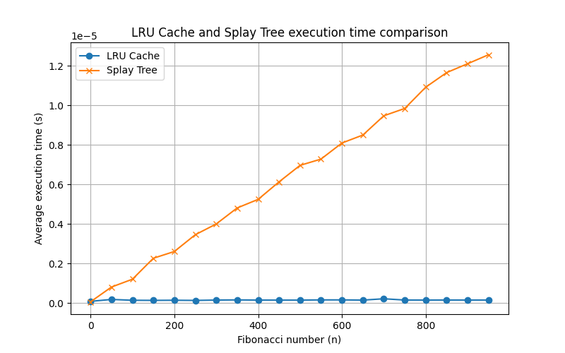

# goit-algo2-hw-07
The repository for the 7th GoItNeo Design and Analysis of Algorithms homework

### Task 1: Optimization of data access using LRU cache
Implement a program to optimize the processing of requests to an array of numbers using an LRU cache.

#### Requirements:
1. Given an array of size N, consisting of positive integers (1 ≤ N ≤ 100,000). It is necessary to process Q queries (1 ≤ Q ≤ 50,000) of the following type:
Range(L, R) — find the sum of elements in the segment from index L to R inclusive.
Update(index, value) — replace the value of the element in the array at index with the new value.

2. Implement four functions to work with an array:
- range_sum_no_cache(array, L, R)
The function must calculate the sum of the elements of the array from L to R inclusive without using a cache. For each query, the result must be computed anew.

- update_no_cache(array, index, value)
The function must update the value of the array element at the specified index without using cache.

- range_sum_with_cache(array, L, R)
The function should compute the sum of elements in the range from L to R inclusive, using an LRU cache. If the sum for this segment has already been computed earlier, it should be returned from the cache; otherwise, the result is computed and added to the cache.

- update_with_cache(array, index, value)
The function should update the value of the array element at the specified index and remove all corresponding values from the cache that have become outdated due to the change in the array.

3. For testing the program, create an array of 100,000 elements filled with random numbers, and generate 50,000 Range and Update queries in random order.
Example of a list of queries: [('Range', 46943, 91428), ('Range', 5528, 29889), ('Update', 77043, 78), ...]

4. Use an LRU cache of size K = 1000 to store precomputed results of Range-type queries. The cache should automatically remove the least recently used items when its maximum size is reached.

5. Compare the execution time of the queries:
- Without using cache.
- Using an LRU cache.

Output the results in terms of execution time for both approaches.
#### Results:
Execution time without caching: 3.61 seconds

Execution time with LRU-cache: 3.47 seconds

### Task 2: Comparison of Fibonacci number computation performance using LRU cache and Splay Tree
Implement a program to compute Fibonacci numbers in two ways: using an LRU cache and using a Splay Tree to store precomputed values. Conduct a comparative analysis of their efficiency by measuring the average execution time for each approach.

#### Requirements:
1. Implement two functions to calculate Fibonacci numbers:
fibonacci_lru(n)
The function should use the @lru_cache decorator to cache the results of computations. Thanks to this, it can reuse the previously computed Fibonacci numbers.
- fibonacci_splay(n, tree)
The function uses the Splay Tree data structure to store computed values. If the Fibonacci number for the given n has already been computed, the value should be returned from the tree; otherwise, the value is computed, stored in the Splay Tree, and returned.

2. Measure the execution time of calculating Fibonacci numbers for each approach:
- Create a set of Fibonacci numbers from 0 to 950 with a step of 50: 0, 50, 100, 150, ....
- Use the timeit module to measure the execution time of computations.
- For each value of n, calculate the average execution time for computing the Fibonacci number using an LRU cache and a Splay Tree.

3. Build a graph that compares the execution time for two approaches:
- Use the matplotlib library to create the graph.
- On the x-axis, plot the value of n — the Fibonacci number index.
- On the y-axis — average execution time in seconds.
- Add a legend to the graph indicating the two approaches: LRU Cache and Splay Tree.

4. Draw conclusions about the effectiveness of both approaches based on the obtained graph.

5. In addition to constructing the graph, output a text table that contains the values of n, the average execution time for LRU Cache, and Splay Tree. The table should be formatted for easy reading.

#### Results:

Splay Tree develops substantially slower with increasing n, but LRU remains consistently fast. When dealing with large Fibonacci numbers, LRU is more effective.

| n   | LRU Cache Time (s) | Splay Tree Time (s) |
| --- | ------------------ | ------------------- |
| 0   | 0.000000084         | 0.000000061          |
| 50  | 0.000000181         | 0.000000809          |
| 100 | 0.000000139         | 0.000001205          |
| 150 | 0.000000134         | 0.000002267          |
| 200 | 0.000000140         | 0.000002607          |
| 250 | 0.000000132         | 0.000003456          |
| 300 | 0.000000149         | 0.000004000          |
| 350 | 0.000000157         | 0.000004812          |
| 400 | 0.000000148         | 0.000005245          |
| 450 | 0.000000147         | 0.000006134          |
| 500 | 0.000000146         | 0.000006966          |
| 550 | 0.000000158         | 0.000007284          |
| 600 | 0.000000158         | 0.000008098          |
| 650 | 0.000000147         | 0.000008502          |
| 700 | 0.000000215         | 0.000009477          |
| 750 | 0.000000150         | 0.000009848          |
| 800 | 0.000000148         | 0.000010924          |
| 850 | 0.000000150         | 0.000011663          |
| 900 | 0.000000149         | 0.000012111          |
| 950 | 0.000000149         | 0.000012567          |